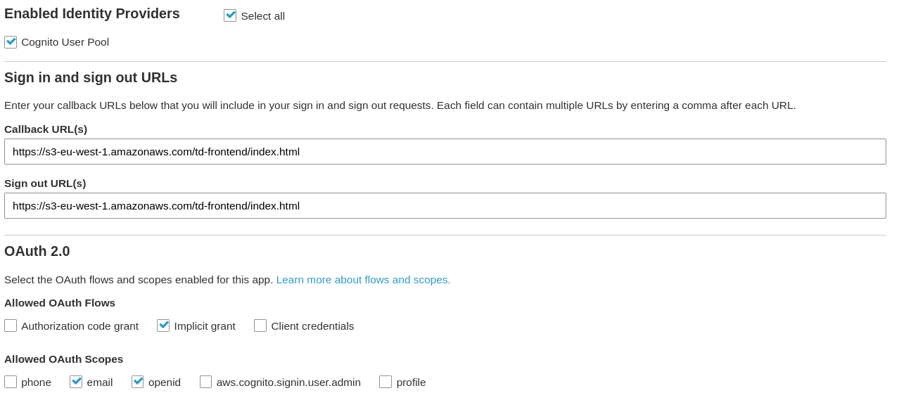

# Todo List

Serverless todo list application with chat bot,text to speech, speech to text support

The app constists of serveral lambda-based services and frontend web application.

Check frontend documentation [here](Frontend/README.md) 
## Lambda Services

1. TodoApi - set of lambda functions for basic CRUD operations working with data in dynamo db.
   - POST /todo - create a new item
   - PUT /todo - update item
   - GET /todo  - list all items
   - GET /todo/id - get item
   - DELETE /todo/id - delete item
   
2. NoteApi - set of lambda functions working with trascribe service
  - POST /note - init transcribe job
  - GET /note/id - get transcribe result

3. Schedule API - ser of lambda functions working with polly service
  - PUT /schedule/day - init polly job
  - GET /schedule/day/id - get polly job result

## Build and deploy lambda

```
cd <lambda-folder>

./gradlew clean build

cd ../CloudResources
terraform init (only first time )
terraform apply
```

# Note

- For tests Local DynamoDB is required

```
docker pull amazon/dynamodb-local

docker run -d -p 8000:8000 --name <container-name> amazon/dynamodb-local
```

- Verify via API Gateway console that the API is actually deployed and deploy manually if not.

- User pool requires manual setup. Check Screenshot below



- Users added via cognito pool

- Ids are taken from cognito console

- CORS must be enabled manually on API gateway
